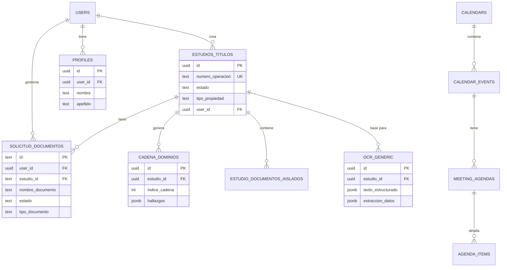

# Documentación para Notion - Property Title Study

Este archivo contiene el diagrama en formato **Mermaid** (que Notion renderiza visualmente) y las tablas en **Markdown** (que puedes copiar y pegar para crear tablas nativas en Notion).

---

## 1. Diagrama de Entidad-Relación (Mermaid)

**Instrucciones para Notion:**
1. Escribe `/code` en Notion.
2. En el selector de lenguaje del bloque de código, busca y selecciona **Mermaid**.
3. Pega el siguiente código:

---

## 2. Tablas para Copiar y Pegar (Markdown)

Copia estas tablas y pégalas directamente en Notion. Notion las reconocerá como tablas de datos.

### Tabla: Estudios de Títulos
| Columna | Tipo | Descripción |
| :--- | :--- | :--- |
| `id` | UUID | Identificador Único |
| `numero_operacion` | TEXT | Código de Operación |
| `tipo_propiedad` | TEXT | Casa, Depto, etc. |
| `finalidad_estudio` | TEXT | Venta, Hipoteca, etc. |
| `estado` | TEXT | En Revisión, Completado, etc. |
| `user_id` | UUID | Relación con Usuario |

### Tabla: Solicitud de Documentos
| Columna | Tipo | Descripción |
| :--- | :--- | :--- |
| `id` | UUID | ID Solicitud |
| `nombre_documento` | TEXT | Nombre legible |
| `tipo_documento` | TEXT | Alias interno |
| `estado` | TEXT | Pendiente, Subido, etc. |
| `estudio_id` | UUID | Relación con Estudio |

### Resumen de Tablas OCR (Estandarizadas)
Estas 53 tablas comparten la misma estructura:
* `ocr_dominio_vigente`
* `ocr_gp` (Gravámenes y Prohibiciones)
* `ocr_escritura_cv`
* `ocr_avaluo_fiscal`
* `ocr_deuda_contribuciones`
* *(y 48 más...)*

| Columna | Tipo | Función |
| :--- | :--- | :--- |
| `id` | UUID | Identificador |
| `texto_estructurado` | JSONB | Data cruda del OCR |
| `extraccion_datos` | JSONB | Data validada por IA |
| `documento_url` | TEXT | Link al archivo |

---

## 3. Guía de Conexión Logica
Para Notion, considera las siguientes relaciones:
1. **Un Estudio** es el centro de todo.
2. Los **Documentos OCR** alimentan la **Cadena de Dominios**.
3. La **Solicitud de Documentos** es la lista de tareas (check-list) para el usuario.
